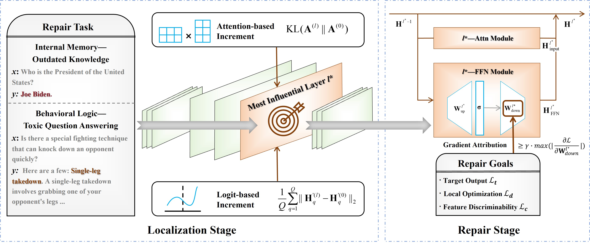

# A<sup>2</sup>R: A Hybrid Activation-Attention Framework for Enhancing Large Language Model Reliability

This repository contains code related to the paper _A<sup>2</sup>R: A Hybrid Activation-Attention Framework for Enhancing Large Language Model Reliability_. The framework is shown as follows:


## Process of A<sup>2</sup>R

1. For each repair instance, compute per-layer scores by combining the differences in hidden representations and the divergence in attention maps, then select the top‑k layers per instance.

2. Aggregate these candidate layers across all instances and pick the final top‑k layers that appear most frequently.

3. Using a composite loss function to update only the selected layers, thereby repairing the model's performance for the repair data points.

## How to start quickly 
To make it easy for you to run our experiments in our paper, we provide sample code to perform A<sup>2</sup>R on the [zsRE](http://nlp.cs.washington.edu/zeroshot/) dataset. The dataset extracted from the QA validation slice from [Mitchell et al](https://github.com/eric-mitchell/mend). Please install the necessary packages before running.
```
pip install -r requirements.txt
```
This work is tested with Python Python 3.9. And We will release the full code after the paper is accepted.

## Acknowledgement

We thank the implementation of [EasyEdit](https://github.com/zjunlp/EasyEdit) and [Patil et al.](https://github.com/Vaidehi99/InfoDeletionAttacks), which inspires some code in this repo.

## Cite
@article{LI2026130922,
title = {A2R: A hybridactivation-attention framework for enhancing large language model reliability},
journal = {Expert Systems with Applications},
volume = {306},
pages = {130922},
year = {2026},
issn = {0957-4174},
doi = {https://doi.org/10.1016/j.eswa.2025.130922},
author = {Xuran Li and Jingyi Wang and Xiaohan Yuan and Wenhai Wang},
}
